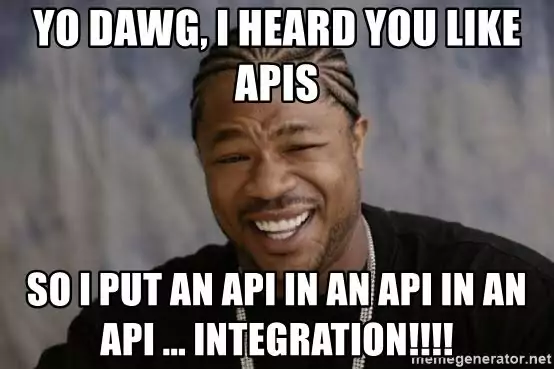

[](https://github.com/firstcontributions/open-source-badges)
[](https://join.slack.com/t/firstcontributors/shared_invite/zt-vchl8cde-S0KstI_jyCcGEEj7rSTQiA)
[](https://opensource.org/licenses/MIT)

# Parking Decision Micro-Service
### _Backend Service for giving inspiration for a template-study_
### _Level: easy-medium_
### _This repo will take you fast-forward on the road!_

### _This repository contains backend code, using the FastAPI framework._


## _Stuff_

- CI with GitHub Actions
- CD with AWS (todo)
- FastAPI + Pg DB + Docker
- Best practices implementations
- Using:
- construct func, DAL, ORM, TDD full coverage, docker, swagger
- Workflows, git hooks, SDK, common, PEP8 helpers, PR templates
- TODO (serverless, dev, stg, uat, prd)
- 
## Tech

This repository uses number of open source projects to work properly:

- [Github Actions] - Uses workflows to run linters, releasing, and deployments
- [FastAPI] - backend framework for building web applications
- [Python] - ''Strongly'' typed code with Python
- [Pre-commit] - Git hooks
- [Docker] - Deliver repository code ready to use without manually installing softwares
- [Flake8] - Linting the code and prevents bad code (checks if your code complies with the PEP8 style)
- [Black] - Formatting the code and prevents bad code
- [Git] - Version manager for the repository
- [pyproject.toml] - codeStyling (A new config file defined in PEP 518, expanded in PEP 621 and PEP 660)
- [unittest] - Unit-tests for code
- [PIP] - Package manager
- [isort] Importing sorting to organize all the imports in our codes
- [PEP8] Line length is 79, which is the PEP8 standard used by Flake8
- [Pylint] Checks for bugs, helps enforce a coding standard
- [mypy] Checks for Static typing
- [Dependabot] Keeping the dependencies updated automatically, Keeps on Productivity
- [requirements.txt] Using Dependabot to make sure we always have the latest version

## Installation

Parking decider requires [Python](https://www.python.org/downloads/) to run.

## Setup

To manually create a virtualenv on MacOS and Linux:

```sh
python3 -m venv venv
```

After the init process completes and the virtualenv is created, you can use the following
step to activate your virtualenv.

```sh
source venv/bin/activate
```

Once the virtualenv is activated, you can install the required dependencies.

```sh
pip install -r requirements.txt
```

## DB

```sh
docker compose up -d
```

## Schema

```sh
setup_db_schema() function inside db/migrations/setup_db_schema.py
```

## 3rd Party API

Parking decision uses the following APIs.
This API is know how to get an image and extract the text from it.

| API              | Documentation |
|------------------| ------ |
| OCRapi           | https://ocr.space/ocrapi |



## Format

```sh
pre-commit run --all-files
```

## Tests

```sh
python -m pytest
```

## Maintain

```sh
pip3 freeze >> requirement.txt
```

## DB Logs

```sh
docker logs -f local_pgdb
```

## Docker
```sh
#build-an-image
$ docker build --tag my-python-docker-image-app
```
```sh
#verify-image
$ docker images
```
```sh
#tag-image
$ docker tag my-python-docker-image-app:latest python-docker:v1.0.0
```
```sh
#remove-tag
$ docker rmi python-docker:v1.0.0
```
```sh
#start-container
$ docker run -d --name mycontainer -p 80:80 my-python-docker-image-app
```

## Help

```sh
$ docker ps, kill, down, inspect
```
```sh
$ pre-commit uninstall
```

## PgAdmin

To configure pgadmin – open a browser and go to – http://localhost:5050/ . 
In the connection details for hostname give the container name of postgreSQL

## removeContainer
```sh
docker stop pgadmin4_container
```
```sh
docker container rm pgadmin4_container
```
## DockerCompose
```sh
docker compose down 
```
```sh
docker compose up -d
```
