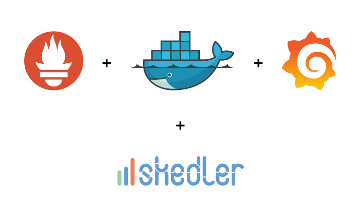

# monitoring

Monitoring Servers and Docker Containers using Prometheus with Grafana

# _Basic Infrastructure monitoring for application performance management._

### _Tech_
Grafana- Database for Analytics & monitoring solution

Prometheus- Event monitoring and alerting

Node-Exporter- Monitoring Linux host metrics

Wmi-Exporter- Monitoring Windows host metrics

CAdvisor- Monitoring metrics for the running Containers.

Skedler Reports -Automating actionable reports

### _Prerequisite_

A Linux machine

Docker Installed

Docker Compose Installed

### _Steps_

Git clone project

docker compose down 

docker compose up -d

go to for Prometheus: http://0.0.0.0:9090/graph

go to for Grafana: http://0.0.0.0:3000/login (admin, secure_pass)